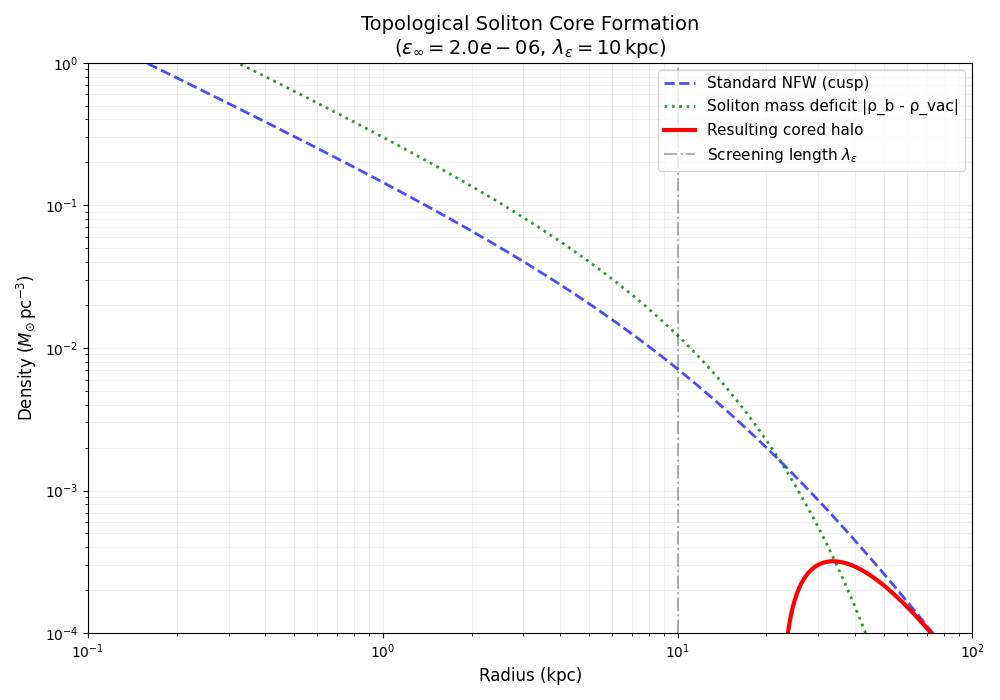
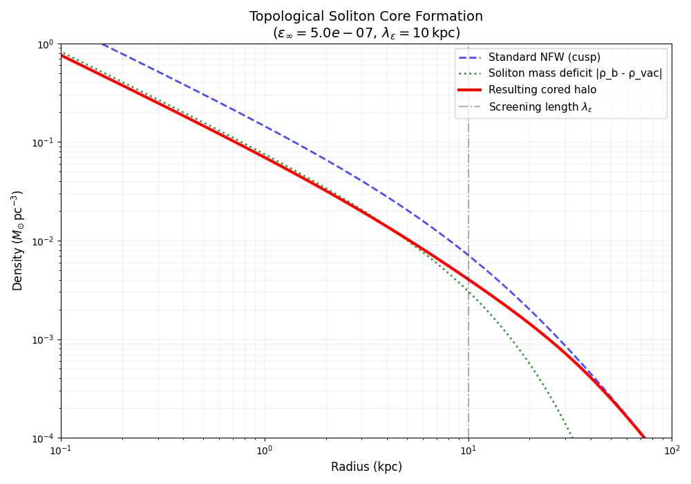

[](https://doi.org/10.5281/zenodo.17727021)
[](LICENSE)

# Topological Dark Solitons and the Core–Cusp Problem

This repository contains the theory, code, and data supporting:

> **Topological Dark Solitons from Mutual Chern–Simons Locking:  
> A Stable Resolution of the Core–Cusp Problem**

by **Xicplice**.

---


We study a dark-sector model with two ultra-weakly coupled U(1) gauge fields linked by a mutual Chern–Simons term.  
On a topologically wound background this interaction generates a scalar mode $\varepsilon(\mathbf{x})\$ obeying a screened Helmholtz equation:

```math
\left(\nabla^2 - \frac{1}{\lambda_\varepsilon^2}\right)\varepsilon
= -\frac{8\pi G}{c^2}\rho_b(\mathbf{x})
```

with screening length:

```math
\lambda_\varepsilon = \frac{R}{\sqrt{n_1 n_2}}.
```

The exact spherical solution:

```math
\varepsilon(r) = \varepsilon_\infty\left(1 - e^{-r/\lambda_\varepsilon}\right)
```

induces a soliton-like baryonic density profile:

```math
\rho_b(r) = \frac{c^2\varepsilon_\infty}{8\pi G\lambda_\varepsilon^2}
\left(1 - \frac{2\lambda_\varepsilon}{r}e^{-r/\lambda_\varepsilon}\right),
```

with total defect mass:

```math
\Delta M = -1\,\frac{c^2\varepsilon_\infty\lambda_\varepsilon}{G}.
```

For $\lambda_\varepsilon \sim 10\ \mathrm{kpc}$, this removes
$\sim 10^{11} M_\odot$ from the inner halo—naturally converting an NFW cusp into a core while preserving large-scale ΛCDM phenomenology.

---

<table>
<tr>
<td></td>
<td></td>
</tr>
<tr>
<td></td>
<td></td>
</tr>
</table>

---

Topological Dark Soliton – Core–Cusp Plot
<table>
<tr>
<td></td>
<td></td>
</tr>
</table>

---

## Repository Contents

- `paper.tex` — main LaTeX source of the paper  
- `docs/theory.md` — theoretical derivations and model explanation  
- `docs/numerics.md` — numerical methods and implementation details  
- `src/helmholtz_solver.py` — analytic Helmholtz–soliton solver with regularisation  
- `src/density_profiles.py` — soliton density, mass, and velocity tools  
- `src/locking_energy.py` — topological phase-locking (Josephson-like) sector  
- `src/stability_tests.py` — regression and consistency tests  
- `examples/milky_way_profile.py` — Milky Way–like soliton demonstration  
- `examples/parameter_scan.py` — parameter scan across $\lambda_\varepsilon\$ and $\varepsilon_\infty\$

---

## Installation

Clone and create a virtual environment:

```bash
git clone https://github.com/xicplice/topological-dark-solitons.git
cd topological-dark-solitons

python -m venv venv
source venv/bin/activate      # Windows: venv\Scripts\activate
pip install -r requirements.txt
```

(Optional) Install the package in editable mode:

```bash
pip install -e .
```

---

# Quick Start

## Example 1: Milky Way–like soliton profile

From the repository root:

```bash
python -m examples.milky_way_profile
```

This prints:

- soliton parameters  
- example scalar field values  
- regularised density values  
- approximate defect mass $\Delta M\$

---

## Example 2: Parameter grid scanning

Explore how the defect mass scales with $\lambda_\varepsilon\$ and $\varepsilon_\infty\$:

```bash
python -m examples.parameter_scan \
    --R 1.0 \
    --n1 12 --n2 93 \
    --eps-inf-min 1e-7 --eps-inf-max 1e-5 --n-eps 5 \
    --lambda-factor-min 0.5 --lambda-factor-max 2.0 --n-lambda 5
```

This outputs a table:

```
lambda_factor   lambda_eps   eps_inf   defect_mass
```

---

# Development & Testing

A basic numerical sanity-check suite is included.

Run it using:

```bash
python -m src.stability_tests
```

This performs:

- finiteness and monotonicity checks of $\rho(r)\$  
- negative-defect-mass verification  
- rotation-curve smoothness checks  

Typical output:

```
=== Stability test suite ===
[OK] Test passed.
[OK] Test passed.
[OK] Test passed.

Overall status: PASS
```

---
# Overview 
This project explores a dark-sector mechanism in which two ultra-weakly coupled 
U(1)
U(1) gauge fields generate a stable scalar structure known as a topological dark soliton.
Such a soliton behaves as a smooth, extended “bubble” in the dark sector that naturally reduces gravitational mass in the central region of a galaxy.
The resulting profile converts the steep central cusp predicted by standard cold dark matter into the shallow, flat core that is commonly observed in dwarf and spiral galaxies.

This approach provides an analytically controlled and numerically stable explanation for the long-standing core–cusp problem without modifying large-scale cosmology or invoking strong baryonic feedback.
The soliton profile is fully analytic, topologically protected, and can be incorporated directly into galactic models and simulations.

What the Model Provides

A screened Helmholtz equation describing the scalar mode 
ε(r)
ε(r) sourced by the dark soliton.

Closed-form expressions for the soliton-induced density profile, its asymptotic vacuum density, and the total mass deficit.

A finite-core regularisation that removes the central 
1/r
1/r singularity while preserving the correct exterior behaviour.

Analytic rotation curves and cumulative mass profiles derived directly from the soliton density.

A consistent and stable framework suitable for astrophysical modelling, parameter scans, and numerical exploration.

Capabilities of This Repository

Compute the soliton’s scalar field, density profile, and defect mass.

Generate cored dark-matter halo profiles that smoothly replace the central NFW cusp.

Produce rotation curves and mass-distribution plots for comparison with observational data.

Run parameter scans over the screening length and soliton amplitude.

Perform sanity and stability checks on the resulting density and velocity profiles.

Integrate the model into larger simulations or theoretical studies with minimal overhead.

Summary

Topological dark solitons offer a simple, stable, and physically consistent mechanism for producing cored galactic density profiles within the standard cosmological framework.
This repository provides the analytic tools, numerical routines, and examples required to explore these structures and apply them in astrophysical contexts.
---

# Citation

A `CITATION.cff` file is provided.  
GitHub natively supports this; citation metadata is exported automatically.

If you use this work, please cite it using the provided citation file.

---

# License

- **Code:** Apache-2.0  
- **Paper:** CC-BY-4.0  

See repository metadata for details.
